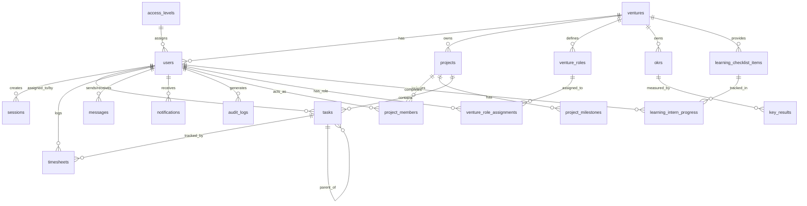

# Entity Relationship Diagram

```mermaid
erDiagram
    ventures ||--o{ users : "has"
    ventures ||--o{ projects : "owns"
    ventures ||--o{ venture_roles : "defines"
    
    access_levels ||--o{ users : "assigns"
    
    users ||--o{ sessions : "creates"
    users ||--o{ tasks : "assigned_to/by"
    users ||--o{ timesheets : "logs"
    users ||--o{ messages : "sends/receives"
    users ||--o{ notifications : "receives"
    users ||--o{ audit_logs : "generates"
    
    projects ||--o{ project_members : "includes"
    projects ||--o{ project_milestones : "has"
    projects ||--o{ tasks : "contains"
    
    tasks ||--o{ timesheets : "tracked_by"
    tasks ||--o{ tasks : "parent_of"

    users ||--o{ project_members : "acts_as"
    
    venture_roles ||--o{ venture_role_assignments : "assigned_to"
    users ||--o{ venture_role_assignments : "has_role"
    
    ventures ||--o{ okrs : "owns"
    okrs ||--o{ key_results : "measured_by"
    
    ventures ||--o{ learning_checklist_items : "provides"
    learning_checklist_items ||--o{ learning_intern_progress : "tracked_in"
    users ||--o{ learning_intern_progress : "completes"
```
